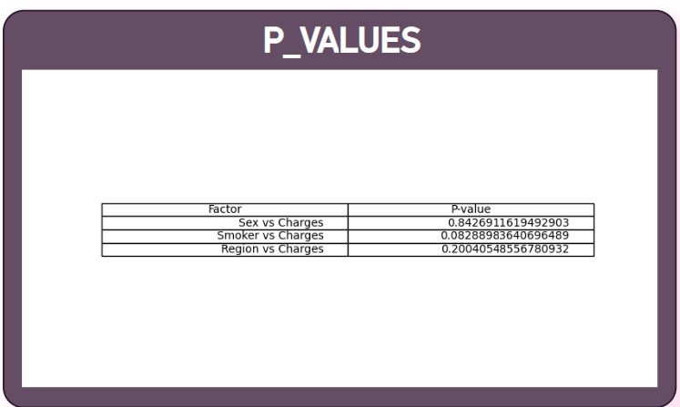

#POWEr BI REPORT
Click Here:(https://gagandeep-1.github.io/AnalystVision/) To view the Power BI Reprt.
# HEALTH INSURANCE ANALYSIS REPORT
#OVERVIEW

This repository contains a Power BI Report analyzing Health Insurance data. The Report explores Key aspects such as medical charges, BMI, Age, and how they vary by 
categorical features like "sex","region", and "smoker status".
#Objective
The purpose of this report is to provide insights into how different factors like gender, smoking insights and region affect health insurance charges and other health 
metrics.It helps identify trends and potential areas for further analysis.
# Features
 **Categorical Data Analysis**: Visualizes the relationship between **sex**, **region**, **smoker** status, and health-related numerical variables.
- **Numerical Data Analysis**: Focuses on analyzing **BMI**, **age**, **charges**, and **children** across different categories.
- **Interactive Visuals**: Users can interact with charts to filter data by region, sex, smoker status, etc.
- **Key Insights**: Understand how **smoking** and **region** influence **health insurance charges**.

- > Note: The report is publicly accessible via the link. If you want to explore it privately, please contact the administrator for access.
  >
  > ## Data Sources : Kaggle (https://www.kaggle.com/datasets/mustafaoz158/healthcare-insurance)
- Health insurance claims data
- Medical records, including BMI, age, and number of children
- Demographic information: **sex**, **region**, **smoker status**

- ## Key Metrics:
- **Charges**: Total medical charges incurred by each individual.
- **BMI**: Body Mass Index (BMI) of the individual.
- **Age**: Age of the individual.
- **Children**: Number of children or dependents covered under the health insurance plan.
- > The report above shows the medical charges distribution across different regions.
  

  ### Exploratory Data Analysis (EDA)
The following **EDA** steps were conducted to prepare the data for analysis:

#### 1. **Data Cleaning**:
   - Missing values were identified in columns such as **age**, **BMI**, and **charges**. Rows with missing values were removed for a cleaner dataset.
   - Outliers in the **BMI** and **Age** column were detected using **box plots**, and values that were extreme (beyond 1.5 * IQR) were flagged for review.
   - It is confirmed that the dataset contains no duplicate rows, ensuring data integrity.

 2. Z-Score Analysis

![Z-Score Plot for Charges] (
- **Children**: The Z-score for **children** is 0.18, indicating that the data points for this variable are close to the mean and there are no significant outliers.
- **BMI, Charges, Age**: The Z-scores for **BMI**, **charges**, and **age** are all 0, indicating that these variables are centered around the mean, with no extreme values detected.
- Since the Z-scores for all numerical columns are close to 0, there were no extreme outliers found in the dataset during the **EDA** process.

3.- Two-Tailed Annova Tests:      (!Screenshot](Screenshot 2025-03-17 2215569.jpg)
- Sex vs Charges (p = 0.842): There is no significant relationship between sex and charges.Sex: Sex does not significantly affect charges.
-Smoker vs Charges (p = 0.082): There is a borderline relationship between smoking status and charges, but it's not statistically significant at the 0.05 level.Smoking Status: Smoking status shows a borderline effect on charges, but it is not significant enough to confirm a strong relationship.
-Region vs Charges (p = 0.200): There is no significant relationship between region and charges.Region: Region does not significantly affect charges.
In conclusion, charges are not strongly affected by sex, region, or smoking status based on the statistical analysis.

4.-Correlation Matrix      (!Screenshot](Screenshot 2025-03-17 221635.png)
- Strong Positive Correlation between Age and BMI (0.91): This indicates that as age increases, BMI tends to increase as well. This is a very strong positive relationship.
 -Moderate Positive Correlation between Age and Children (0.78): Older individuals tend to have more children.
 -Moderate Positive Correlation between BMI and Children (0.72): Individuals with higher BMI tend to have more children.
 -Weak Positive Correlation between Age and Charges (0.14): There's a slight tendency for older individuals to have higher charges, but the relationship is weak.
 -Weak Positive Correlation between BMI and Charges (0.33): There's a  tendency for individuals with higher BMI to have higher charges.
 -Weak Negative Correlation between Children and Charges (-0.05): There's almost no correlation between the number of children and charges.
 -No Strong Negative Correlations: There are no strong negative correlations observed in this matrix.

   5. **Visualizing Results in Power BI**:
   - **Python** scripts within Power BI were used to generate the following visualizations:
     - **Heatmaps** for correlation analysis to visually understand relationships between variables.
     - **ANOVA p-value heatmaps** to display which categorical variables significantly affect the **charges**.
     - **Box plots** for **charges** by **region**, **smoker status**, and **sex** to show distribution and outliers.

